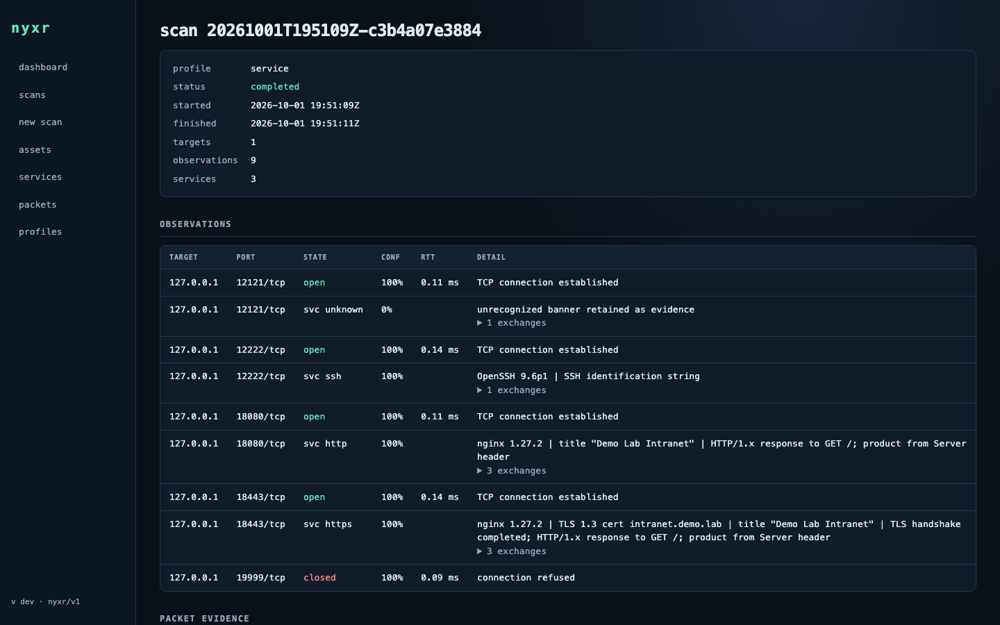
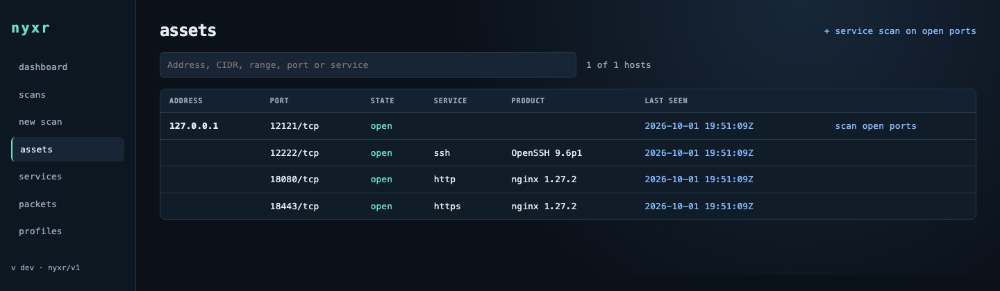
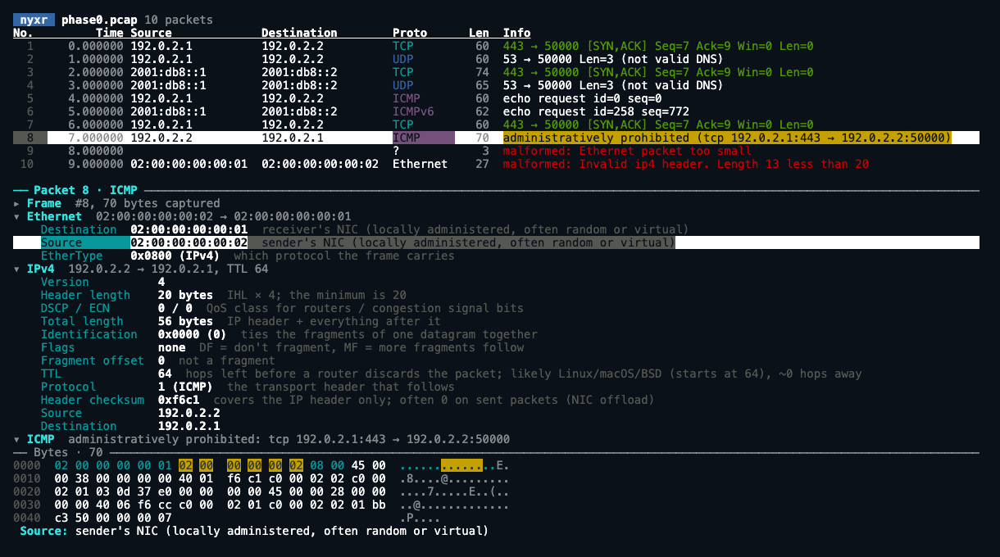
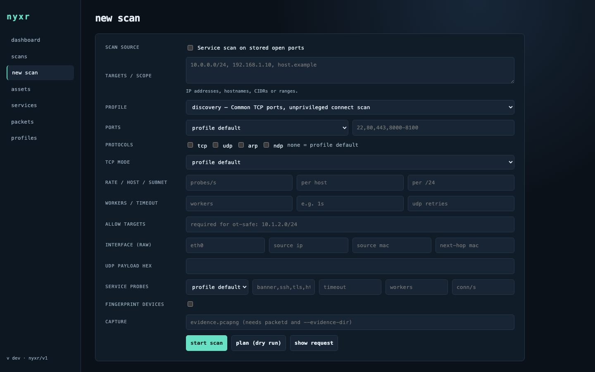

<h1 align="center">nyxr</h1>

<p align="center">
  <strong>Fast discovery. Deep, evidence-backed identification. One CLI, API and web UI.</strong>
</p>

<p align="center">
  <a href="https://github.com/matusso/nyxr/actions/workflows/build.yml"></a>
  <a href="https://github.com/matusso/nyxr/releases"></a>
  <a href="LICENSE"></a>
</p>

<p align="center">
  
</p>

nyxr is a cross-platform network scanner written in Go. It finds open ports
quickly, then works out what is actually running on them, and keeps the bytes
that prove it.

- **Evidence, not guesses.** A service is claimed only from a matched
  response. Every result carries a confidence, a reason and the raw exchange.
- **UDP done properly.** Protocol payloads, per-scan transaction tokens and
  ICMP correlation. Silence stays `open|filtered`, never "open".
- **Safe for fragile networks.** The `ot-safe` profile enforces allowlists, low
  rates and read-only Modbus and EtherNet/IP identity reads.
- **Unprivileged by default.** Connect scans, service identification, storage
  and the web UI need no root. Raw packet I/O lives in a separate, narrow
  `nyxr-packetd` process.
- **Everything is kept.** Every scan goes into a local SQLite inventory you
  can query and rescan, with optional pcapng evidence.

## Install

**Homebrew** (macOS, Linux):

```sh
brew tap matusso/nyxr https://github.com/matusso/nyxr
brew install nyxr
```

**Release binaries** for Linux, macOS and Windows (`amd64`, `arm64`) are on the
[releases page](https://github.com/matusso/nyxr/releases).

```sh
tar -xzf nyxr-v0.6.0-linux-amd64.tar.gz
sudo install -m 0755 nyxr-v0.6.0-linux-amd64/nyxr* /usr/local/bin/
```

**Container:**

```sh
docker run --rm ghcr.io/matusso/nyxr:latest scan --ports 80,443 example.com
```

**From source** (Go 1.27.1+, no cgo):

```sh
git clone https://github.com/matusso/nyxr.git && cd nyxr
make build && sudo make install
```

Shell completion for bash, zsh, fish and PowerShell: `nyxr completion <shell>`.
More in [Getting started](docs/getting-started.md).

## Usage

```sh
nyxr scan 192.0.2.10                           # common TCP ports, unprivileged
nyxr scan --profile service 192.0.2.0/24       # identify the services behind open ports
nyxr scan --profile udp-common 192.0.2.10      # UDP with protocol payloads
nyxr scan --profile web --json 192.0.2.10      # TLS and HTTP details as JSON
nyxr scan --dry-run --profile deep 10.0.0.0/24 # show the plan, send nothing

nyxr history --assets --open                   # what is open right now, per host
nyxr serve                                     # web UI at http://127.0.0.1:8484
```

```text
$ nyxr scan --profile service 192.0.2.10
192.0.2.10:22    tcp   open           100% TCP connection established
192.0.2.10:80    tcp   open           100% TCP connection established
192.0.2.10:443   tcp   open           100% TCP connection established
192.0.2.10:22    tcp   svc ssh        100% OpenSSH 9.6p1 | SSH identification string
192.0.2.10:80    tcp   svc http       100% nginx 1.27.2 | title "Intranet" | HTTP/1.x response to GET /
192.0.2.10:443   tcp   svc https      100% nginx 1.27.2 | TLS 1.3 cert intranet.example | title "Intranet"
scan 20261001T195109Z-c3b4a07e3884 completed: 6 observations, 3 services identified
```

Targets can be IPs, hostnames, CIDRs or ranges. Ports accept lists, ranges and
sets such as `top100`, `top1000`, `database` or `all`. Run `nyxr profiles` for
the full profile catalog.

## Use cases

### Build an inventory, then interrogate only what is open

Sweep quickly, then spend time only on ports that answered. Results accumulate
in `~/.nyxr/nyxr.db`.

```sh
nyxr scan --profile fast --ports top1000 192.0.2.0/24
nyxr scan --known-open 192.0.2.0/24
nyxr history --assets --open --scope 192.0.2.0/24
```



### Audit TLS and web endpoints

Certificate chains, TLS versions, ciphers, ALPN, HTTP server, title and
authentication headers, on standard and non-standard ports.

```sh
nyxr scan --profile web --json 192.0.2.0/24 | jq 'select(.kind=="service") | {target, port, product, tls: .tls.version}'
```

### Find database servers that answer without credentials

Response-validated probes for Redis, Memcached, PostgreSQL, MongoDB, Neo4j,
Cassandra, SQL Server, MySQL and HTTP-based databases such as Elasticsearch
and ClickHouse.

```sh
nyxr scan --profile database 192.0.2.0/24
```

### Identify industrial devices without disturbing them

Allowlisted, rate-capped, read-only identity requests. Review the plan before
anything is sent.

```sh
nyxr scan --profile ot-safe --allow-targets 192.0.2.0/24 --dry-run 192.0.2.10
nyxr scan --profile ot-safe --allow-targets 192.0.2.0/24 192.0.2.10
nyxr scan --profile udp --ports 47808 --fingerprint 192.0.2.10   # BACnet
```

### Explain a packet capture

Turn a pcap into hosts and open ports, or step through every packet with a
plain-language note on each header field.

```sh
nyxr decode --all capture.pcapng
nyxr decode --tui capture.pcapng
nyxr decode --last      # the last --interface scan, kept in ~/.nyxr/last.pcapng
```



### Run it as a team service

An unprivileged web UI and REST API, with raw packet access delegated to
`nyxr-packetd`.

```sh
sudo setcap cap_net_raw,cap_net_admin+ep /usr/local/bin/nyxr-packetd
nyxr-packetd --socket /run/nyxr/packetd.sock --interface eth0 &
NYXR_API_TOKEN=$(openssl rand -hex 16) \
  nyxr serve --listen 0.0.0.0:8484 --packetd /run/nyxr/packetd.sock
```



## Documentation

| | |
| --- | --- |
| [Getting started](docs/getting-started.md) | Install, first scan, privileges |
| [User guide](docs/README.md#user-guide) | Scanning, profiles, UDP, services, OT/IoT, capture, web UI |
| [CLI reference](docs/reference/cli.md) | Every command and flag |
| [REST API](docs/guide/web-ui-and-api.md#rest-api) | Endpoints and live events |
| [Architecture](docs/architecture/overview.md) | How nyxr is built |
| [Roadmap](docs/roadmap.md) | What is done and what is next |

Full index: [docs/](docs/README.md).

## Status

nyxr is under active development and pre-1.0. TCP connect, UDP, service
identification, storage, the API and the web UI are covered by loopback and
fixture tests in CI, and release binaries are built for all six platforms.
Raw packet backends (AF_PACKET, BPF, Npcap) are fixture-tested, but their live
behavior has not been verified on every platform yet. See the [Roadmap](docs/roadmap.md) for details.

## Security and responsible use

Scan only networks you own or are authorized to test. To report a
vulnerability, see the [Security policy](docs/SECURITY.md).

## License

nyxr is released under the [MIT License](LICENSE). It can read a user-supplied `nmap-service-probes`
file at runtime; that file belongs to the Nmap Project and is never bundled.
