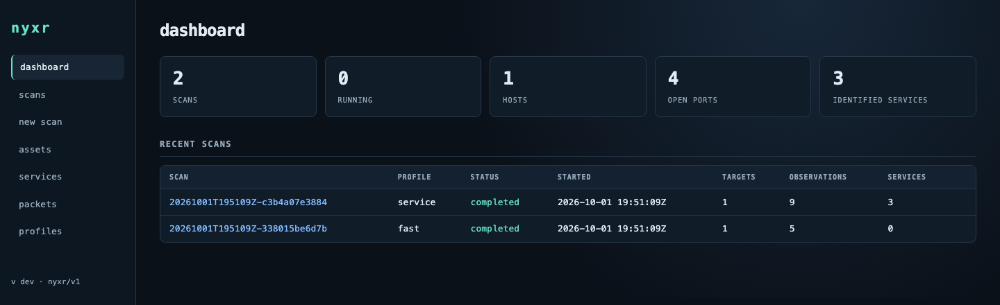
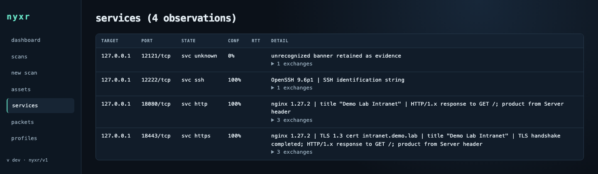

# Web UI and REST API

`nyxr serve` runs a REST API, live scan events and an embedded web UI from one
unprivileged process. The UI is built only on that API, so anything you can do
in the browser you can also script.

- [Start the server](#start-the-server)
- [Web UI tour](#web-ui-tour)
- [Live packets and frame editing](#live-packets-and-frame-editing)
- [REST API](#rest-api)
- [Live events](#live-events)
- [Security model](#security-model)
- [Server flags](#server-flags)

## Start the server

```sh
nyxr serve                                                  # http://127.0.0.1:8484
NYXR_API_TOKEN=$(openssl rand -hex 16) nyxr serve --listen 0.0.0.0:8484
```

A non-loopback listener requires a bearer token; the UI asks for it on first
load. To use raw packet features from the server, see
[Deployment](deployment.md#privilege-separation-with-nyxr-packetd).

## Web UI tour

**Dashboard.** Live scan, host, open-port and service counts, with recent scans.
The counts and scan history refresh while the page is open.



**New scan.** Every scan option, the profile catalog and a dry-run plan before
anything is sent. *Show request* displays the JSON document the UI will post,
which is the same document `nyxr scan --config` accepts.


**Scan detail.** Live results and a running progress indicator, then every
observation with state, confidence and detail. The indicator shows elapsed
time, targets seen and live counters; it does not estimate a completion
percentage because scan stages can add work after discovery. Expand *exchanges* to see the bytes behind a
service claim. Running scans can be cancelled; partial results are kept.


**Assets.** The open-port inventory across all scans, searchable by address,
CIDR, range, port or service, with autocomplete. *Scan open ports* starts a
`--known-open` service scan for one host or the whole scope.


**Identities.** Shows current membership, source evidence, device profile,
link confidence, competing candidates, shared clues, imported LLDP neighbors,
and the membership audit. An operator can record a join, separation, or clear
decision with a reason. See [Asset identity graph](asset-identity.md).

**Services** lists identified services across scans, **profiles** shows the
catalog, and **packets** watches live traffic (below).



## Live packets and frame editing

The **packets** page opens a live watch on an interface that packetd allows. It
keeps the latest 500 frames in the browser and displays up to 100 frames per
second; skipped display frames are reported on a busy interface. Capture rows
are not saved on the server.

- **clone** copies a captured frame into the split hex editor.
- **send edited frame** submits the edited bytes.
- **resend** submits the original bytes.

Watching requires `--packetd`. Sending also requires `--allow-packet-send`.
The send API accepts one 14 to 9216 byte frame per request and returns
`submitted` once packetd accepts it; packetd's interface and source-MAC policy
can still reject the frame before transmission.

## REST API

All paths are under `/api/v1`.

| Method and path | Purpose |
| --- | --- |
| `GET /stats` | Live dashboard counts for scans, running scans, hosts, open ports and identified services |
| `GET /profiles` | Profile catalog, as `nyxr profiles --json` |
| `POST /plan` | Resolve a request and return the dry-run plan |
| `POST /scans` | Start a scan; returns `201` with the running `scan` summary |
| `GET /scans` | Stored scans, newest first, with live counters for running ones |
| `GET /scans/{id}` | One scan summary |
| `POST /scans/{id}/cancel` | Stop a running scan; partial results are kept |
| `GET /scans/{id}/observations` | Stored records. Filters: `address`, `kind`, `transport`, `port`, `service`, `unknown`, `limit` |
| `GET /scans/{id}/evidence` | `packet-evidence` records |
| `GET /scans/{id}/events` | Server-Sent Events: `observation`, `packet-evidence`, `scan` |
| `GET /scans/{id}/pcapng` | The scan's capture file, for captures in `--evidence-dir` only |
| `GET /assets` | Asset inventory. Accepts `open=true` and an IP, CIDR or range `scope` |
| `GET /assets/identities` | Correlated asset IDs, member addresses, per-address ports and source signals |
| `GET /assets/identities/{id}` | One correlated asset, or 404 |
| `GET /assets/identity-events?address=IP` | Durable membership audit; address filter optional |
| `GET /assets/identity-relations` | Shared weak clues between current identities |
| `GET /assets/identity-reviews` | Manual review audit log |
| `POST /assets/identity-reviews` | Record `{address_a,address_b,decision,note}`; decision is `join`, `separate`, or `clear` |
| `GET /assets/topology` | Imported LLDP neighbors, with current identity when management address matches |
| `GET /observations` | Observations across scans |
| `GET /packets/watch?interface=eth0` | Live Ethernet frames as Server-Sent Events; requires `--packetd` |
| `POST /packets/send` | Submit one hex-encoded Ethernet frame; requires `--packetd --allow-packet-send` |

The request body of `POST /scans` and `POST /plan` is the
[scan configuration document](../reference/configuration.md) in JSON. Results
are the same [`nyxr/v1` records](../reference/output-records.md) the CLI prints.
A test runs the same loopback scan through the CLI and the API and requires
identical observations apart from IDs and timings.

```sh
# Start a scan
curl -s -H 'Content-Type: application/json' localhost:8484/api/v1/scans \
  -d '{"targets":["192.0.2.10"],"ports":"22,80,443","protocols":"tcp","service":true}'

# Follow its events
curl -N localhost:8484/api/v1/scans/<scan_id>/events

# With a token
curl -s -H "Authorization: Bearer $NYXR_API_TOKEN" localhost:8484/api/v1/scans
```

**Remote restrictions.** API requests may not name files on the server
(`udp_probe_file`, `payload_file`, Nmap probe files). `pcapng` must be a bare
`*.pcapng` name, which the server places in `--evidence-dir`. The `research`
profile and ICMP are not available through the API; ICMP echo needs a raw IP
socket in the scanning process, which the unprivileged server does not have.

## Evidence reference resolution

`POST /api/v1/evidence/resolve` takes an observation/exchange `source` object from
an observation query or event and returns its exact retained JSON artifact as
base64. `status: "unavailable"` includes a reason and preserves the submitted
reference when retention has removed the source or it belongs to HORIZON.
Authentication, Host and CSRF checks are the same as the other API routes. The
request is limited to 4 KiB and cannot name a server path or URL. Capture downloads
verify recorded size and SHA-256 when an artifact ID exists; modified containers
are unavailable rather than silently reassigned to old packet references.

## Live events

Event streams are bounded so a slow client can never slow a scan:

- Each running scan keeps its last 4096 events for replay.
- Each subscriber has a 256-event queue. A subscriber that falls behind
  receives `lagged` and is disconnected.
- Reconnect with `Last-Event-ID` to resume, or read the stored observations.

`--max-scans` (default 1) limits concurrent scans so they do not exceed each
other's rate budgets.

## Security model

| Control | Behavior |
| --- | --- |
| Listener | Loopback by default |
| Host header | Foreign `Host` headers are rejected, which blocks DNS rebinding |
| Authentication | A non-loopback listener requires a bearer token of at least 16 characters, from `NYXR_API_TOKEN` or `--token-file` |
| CSRF | POSTs must be `application/json`, so a browser cannot send them cross-origin without a preflight; no CORS request is approved |
| Rendering | Strict same-origin Content Security Policy; every scanned value is rendered as text |
| Privileges | The server refuses to run as root or with raw-socket capabilities; see [Deployment](deployment.md) |

One shared token is the only authentication. Users, RBAC, approvals and audit
trails are planned; see the [Roadmap](../roadmap.md#phase-9--enterprise-hardening--planned).

## Server flags

| Flag | Default | Effect |
| --- | --- | --- |
| `--listen` | `127.0.0.1:8484` | Listen address |
| `--db` | `~/.nyxr/nyxr.db` | SQLite database |
| `--token-file` | | File holding the bearer token (alternative to `NYXR_API_TOKEN`) |
| `--max-scans` | 1 | Concurrent scans |
| `--evidence-dir` | | Directory for API pcapng captures |
| `--packetd` | | nyxr-packetd socket for raw scans, capture and live packets |
| `--allow-packet-send` | off | Enable frame transmission from the packets page |
| `--allow-privileged` | off | Allow running as root or with raw-socket capabilities |

### Optional HORIZON API

HORIZON is disabled by default. Operator startup flags enable synthetic
experiments under an independent target/port/profile/permission policy.
`POST /api/v1/horizon/plan`, `/resolve` and `/stop` provide strict experiment
planning, sealed reports and a permanent session kill switch. The request cannot
change server policy. See [HORIZON API controls](../horizon/general-dsl.md#api-and-executor-kill-switch).
